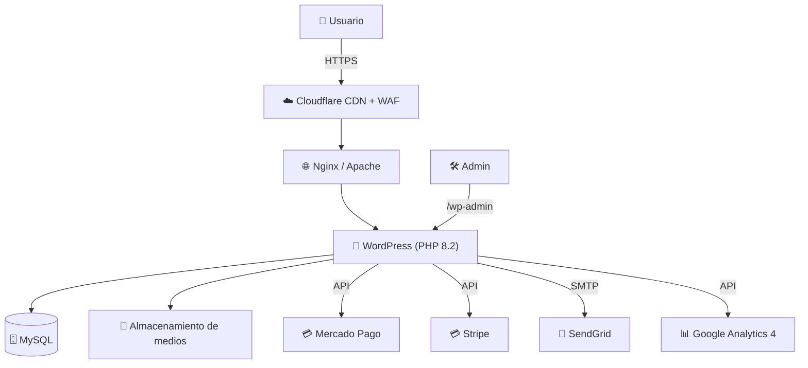
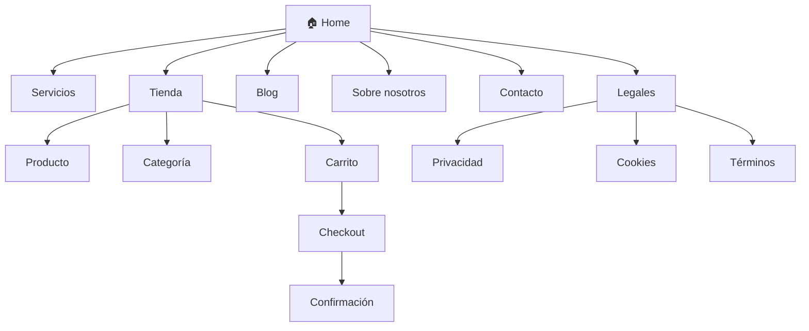
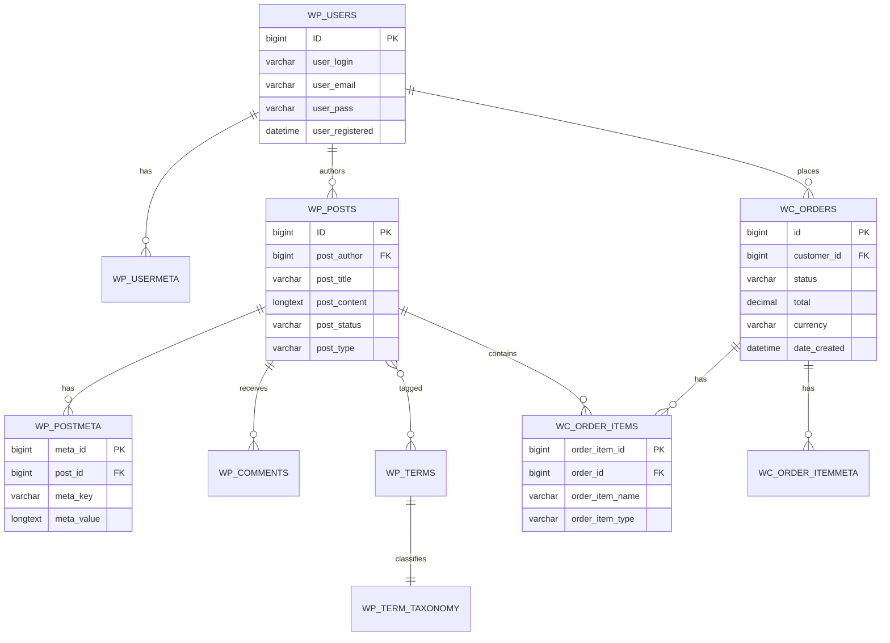
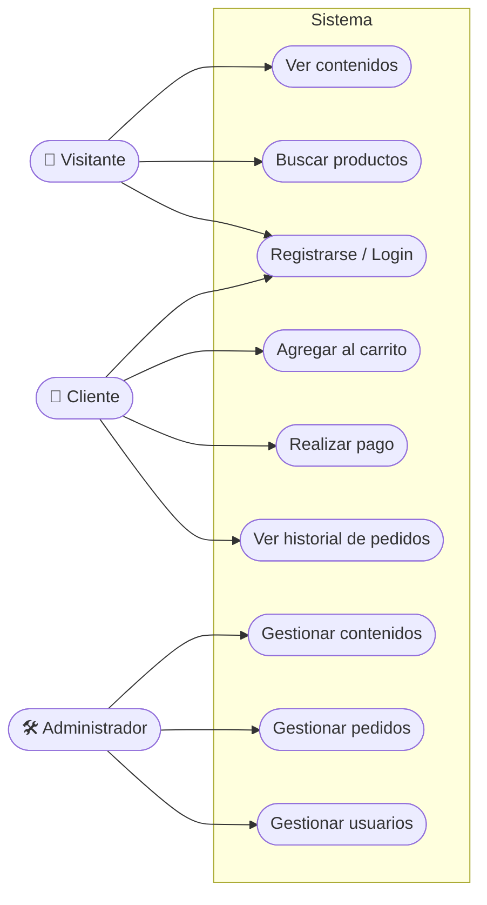
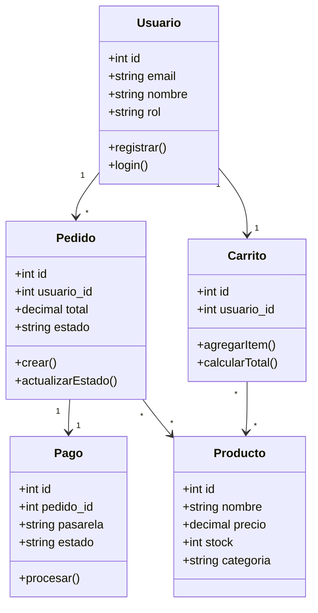
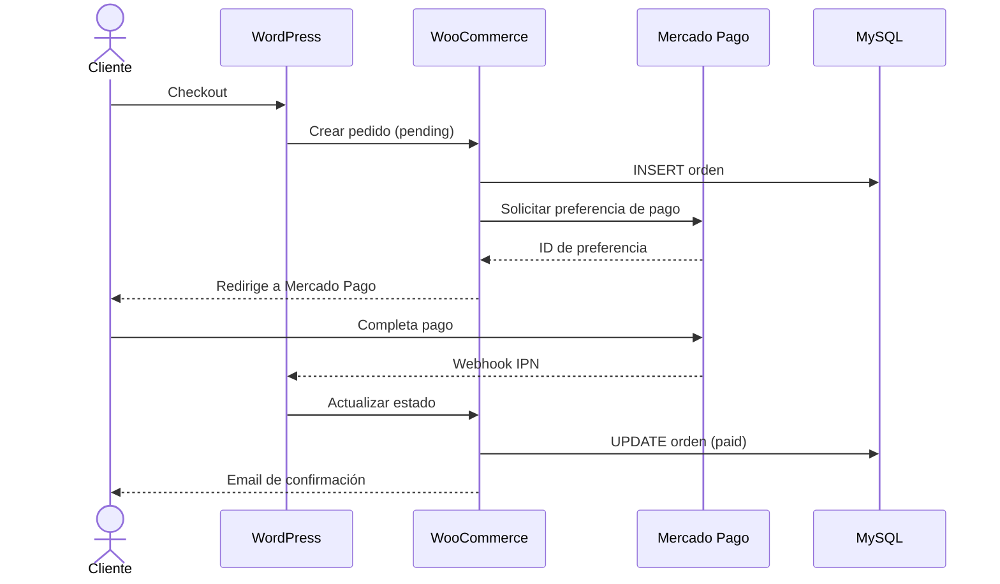
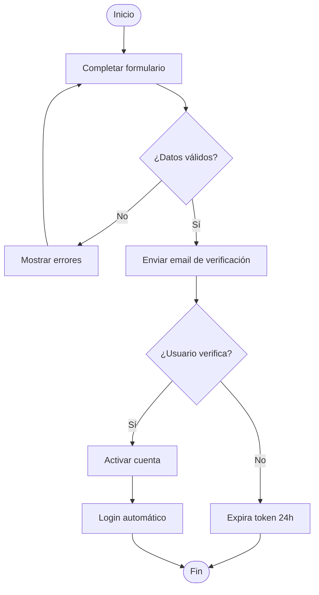
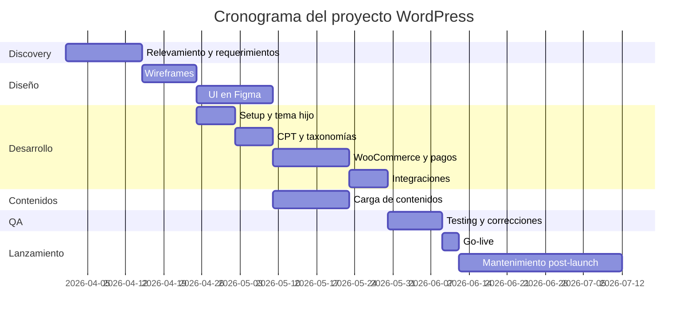

      # Documentación

<aside>
🧩

**TECDA EDDI 3 — Proyecto WordPress**

Documentación integral del proyecto: alcance, equipo, arquitectura, diseño, base de datos, pagos, legales y entregables.

</aside>

---

# 1. Información general

**Nombre del proyecto**

Sitio Web WordPress — TECDA EDI 3

**Versión de documento**

v1.0

**Estado**

🟡 En desarrollo

**Fecha de inicio**

1 de abril de 2026

**Fecha objetivo de lanzamiento**

31 de julio de 2026

**Repositorio**

[GitHub del proyecto](https://github.com/pazrodriguez1976/joyeria-rodriguez.git)

## 1.1 Resumen ejecutivo

Este documento describe de forma integral el desarrollo de un sitio web basado en **WordPress** con integración de **WooCommerce** para la gestión de pagos, contenidos dinámicos, roles de usuario y cumplimiento legal. Incluye requerimientos, tecnologías, diagramas UML, esquema de base de datos, casos de uso, entregables, plazos y currículum del equipo.

## 1.2 Objetivos

- **Objetivo general:** Desarrollar y desplegar un sitio WordPress profesional, seguro, rápido y escalable.
- **Objetivos específicos:**
    - Implementar gestión de contenidos (CMS) mantenible por el cliente.
    - Habilitar pagos online mediante pasarelas (Mercado Pago).
    - Cumplir con la normativa legal vigente (Ley 25.326 de Protección de Datos Personales, GDPR).
    - Alcanzar Core Web Vitals en verde y accesibilidad WCAG 2.1 AA.

## 1.3 Público objetivo y stakeholders

| **Rol** | **Nombre / Área** | **Responsabilidad** |
| --- | --- | --- |
| Sponsor | Cliente / Docente | Aprobación final y validación |
| Product Owner | David Balbi | Priorización y requerimientos |
| Usuario final | Visitantes / Clientes | Consumo de contenidos y compra |
| Administrador | Equipo del cliente | Gestión de contenidos y pedidos |

---

# 2. Equipo de trabajo — Hoja de vida

<aside>
👥

Completar con datos reales de cada integrante. Reemplazar los enlaces de LinkedIn, GitHub y email por los correspondientes.

</aside>

## 2.1 David Balbi —  / Project Lead / Front-end / SEO

**Rol:** Project Lead / Front-end / SEO

**Email:** [davidbalbi@live.com](mailto:davidbalbi23@gmail.com)

**LinkedIn:** [linkedin.com/in/davidbalbi](http://www.linkedin.com/in/david-balbi-203b7b270)

**GitHub:** [github.com/davidbalbi](http://github.com/davidbalbi)

**Skills:** WordPress, PHP, MySQL, JavaScript, HTML/CSS, Git, Elementor

**Responsabilidades:**

- Documentación integral del proyecto
- Maquetación de Home y Tienda (Elementor Free)
- Optimización de performance con lighthouse
- Configuración de SEO técnico

## 2.2 Cecilia Rodriguez — Infraestructura y Gestión de Contenido

**Rol:** Frontend /Infraestructura y Gestión de Contenido

**Email:** ce.rodr13@gmail.com

**LinkedIn:** [linkedin.com/in/usuario](http://linkedin.com/in/usuario)

**GitHub:** [github.com/usuario](http://github.com/usuario)

**Skills:** WordPress, Hosting, Gestión de CMS, WooCommerce

**Responsabilidades:**

- Alta y configuración de Hosting y Dominio (.com.ar)
- Despliegue del entorno WordPress base
- Carga del catálogo de productos en WooCommerce
- Gestión de imágenes, precios y stock para pruebas

## 2.3 Paz Rodriguez — Integración Backend y Pasarela de Pagos

**Rol:** Backend / Base de Datos / Pasarela de Pagos

**Email:** *pazrodriguez1976@gmail.com*

**LinkedIn:** [linkedin.com/in/usuario](http://linkedin.com/in/usuario)

**GitHub:** [github.com/usuario](http://github.com/usuario)

**Skills:** MySQL, PHP, WooCommerce, REST API, Mercado Pago API

**Responsabilidades:**

- Configuración inicial lógica de WooCommerce
- Integración de pasarela de pago (Mercado Pago)
- Pruebas de transacciones y webhooks en entorno Sandbox
- Modelado y documentación de la base de datos

## 2.4 Ornella Nochetti — UX/UI Designer, Legales y QA

**Rol:** UX/UI Designer, Legales y QA

**Email:** *(ornelanochetti@gmail.com)*

**LinkedIn:** [linkedin.com/in/usuario](http://linkedin.com/in/usuario)

**GitHub:** [github.com/usuario](http://github.com/usuario)

**Skills:** TFigma, UX/UI, Testing Funcional, Copywriting Legal

**Responsabilidades:**

- Creación de Wireframes y UI Kit en Figma
- Diseño de prototipos y maquetas visuales
- Redacción de textos legales (Políticas de Privacidad y Cookies - Ley 25.326)
- Ejecución del plan de testing funcional y cross-browser

---

# 3. Roles y permisos

| **Rol WordPress** | **Permisos** | **Asignado a** |
| --- | --- | --- |
| Super Admin | Control total (multisite) | Líder técnico |
| Administrator | Gestión completa del sitio, plugins, usuarios | Equipo dev |
| Editor | Publicar y gestionar todas las entradas | Responsable de contenido |
| Author | Publicar y gestionar entradas propias | Redactores |
| Shop Manager | Gestionar pedidos y productos (WooCommerce) | Cliente |
| Customer | Compras y gestión de cuenta | Usuarios finales |
| Subscriber | Lectura y perfil propio | Newsletter |

---

# 4. Requerimientos

## 4.1 Requerimientos funcionales (RF)

| **ID** | **Descripción** | **Prioridad** |  |  |  |
| --- | --- | --- | --- | --- | --- |
| RF-01 | Gestión de contenidos mediante panel WordPress | Must | RF-02 | Catálogo de productos con categorías y filtros | Must |
| RF-03 | Carrito de compras y checkout | Must | RF-04 | Pagos online con Mercado Pago y Stripe | Must |
| RF-05 | Registro e inicio de sesión de usuarios | Must | RF-06 | Formularios de contacto con captcha | Must |
| RF-07 | Blog con categorías y etiquetas | Should | RF-08 | Búsqueda interna | Should |
| RF-09 | Newsletter con double opt-in | Should | RF-10 | Multidioma (ES/EN) | Could |

## 4.2 Requerimientos no funcionales (RNF)

- **Performance:** Core Web Vitals en verde. LCP < 2.5s, CLS < 0.1, INP < 200ms.
- **Seguridad:** HTTPS, 2FA en admin, WAF (Cloudflare/Wordfence), backups diarios con 30 días de retención.
- **Accesibilidad:** WCAG 2.1 nivel AA.
- **Disponibilidad:** SLA de 99.5% uptime.
- **Compatibilidad:** Chrome, Firefox, Safari, Edge (últimas 2 versiones); responsive desde 320px.
- **Mantenibilidad:** Código versionado en Git, documentación actualizada, tema hijo.
- **Legal:** Cumplimiento de Ley 25.326 (Argentina) y GDPR (UE).

---

# 5. Tecnologías (Stack)

### 🧱 Core

- **CMS:** WordPress 6.x
- **Lenguaje:** PHP 8.2
- **BD:** MySQL 8 / MariaDB 10.6
- **Servidor web:** Nginx / Apache

### 🎨 Frontend

- HTML5, CSS3, JavaScript (ES6)
- SASS /  CSS
- Tema hijo basado en Astra / GeneratePress

### 🛒 E-commerce & Pagos-

- WooCommerce
- Mercado Pago for WooCommerce (Entornos Sandbox y Producción)
- Transferencia Bancaria (Nativo)

### 🔌 Plugins clave

- **SEO**: RankMath
- **Caché:** LiteSpeed Cache / W3 Total Cache
- **Seguridad:** Wordfence
- **Formularios:** WPForms
- **Builder:** Elementor (Free) + Essential Addons
- **Campos:** ACF (Advanced Custom Fields - Free)

### ☁️ Infraestructura

- **Hosting:** railwail
- **Dominio:**(https://joyeria-rodriguez.com.ar/)
- **SSL:** Let's Encrypt
- **Email transaccional:** SendGrid / Mailgun

### 🛠️ Herramientas

- **Diseño:** Figma
- **Control de versiones:** Git + GitHub
- **Gestión:** Notion + Trello
- **Comunicación:** Discord / Slack
- **Testing:** Lighthouse, 

---

# 6. Arquitectura del sistema

## 6.1 Diagrama de arquitectura



## 6.2 Entornos

| Entorno | URL | Propósito |
| --- | --- | --- |
| Desarrollo | [dev.proyecto.com](https://github.com/pazrodriguez1976/joyeria-rodriguez.git) | Trabajo diario del equipo |
| Staging | [staging.proyecto.com](https://github.com/pazrodriguez1976/joyeria-rodriguez.git) | QA y aprobación del cliente |
| Producción | [proyecto.com](https://joyeria-rodriguez.up.railway.app/) | Sitio en vivo |

---

# 7. Diseño (Figma)

<aside>
🎨

**Enlaces de Figma** (reemplazar por los enlaces reales del proyecto)

- Wireframes: [Figma - Wireframes](https://www.figma.com/file/XXXXX/wireframes)
- UI Kit: [Figma - Design System](https://www.figma.com/file/XXXXX/design-system)
- Mockups finales: [Figma - Mockups](https://www.figma.com/file/XXXXX/mockups)
- Prototipo interactivo: [Figma - Prototype](https://www.figma.com/proto/XXXXX)
</aside>

## 7.1 Sistema de diseño

| **Elemento** | **Valor** | Color primario | #2563EB |
| --- | --- | --- | --- |
| Color secundario | #F59E0B | Color de fondo | #FFFFFF / #0F172A (dark) |
| Tipografía titulares | Inter / Poppins | Tipografía cuerpo | Inter / System UI |
| Grid | 12 columnas, gutter 24px | Breakpoints | 320 / 768 / 1024 / 1440 |

## 7.2 Mapa del sitio



---

# 8. Base de datos

## 8.1 Esquema ER (entidades principales WordPress + WooCommerce)



## 8.2 Custom Post Types (CPT) del proyecto

| **CPT** | **Descripción** | **Taxonomía** |
| --- | --- | --- |
| `proyecto` | Portfolio de proyectos | categoria_proyecto, tecnologia |
| `producto` | Productos WooCommerce | product_cat, product_tag |

---

# 9. Diagramas UML

## 9.1 Diagrama de casos de uso



## 9.2 Diagrama de clases (simplificado)



## 9.3 Diagrama de secuencia — Proceso de pago



## 9.4 Diagrama de actividad — Registro de usuario



---

# 10. Casos de uso detallados

## 10.1 CU-01: Realizar compra

| **Actor** | Cliente registrado |
| --- | --- |
| **Flujo principal** | 1. Selecciona producto → 2. Agrega al carrito → 3. Inicia checkout → 4. Completa datos → 5. Elige método de pago → 6. Confirma → 7. Recibe email |
| **Postcondición** | Pedido registrado, stock descontado, notificación enviada |

## 10.2 CU-02: Publicar artículo de blog

| **Actor** | Editor | **Precondición** | Usuario con rol Editor o superior |
| --- | --- | --- | --- |
| **Flujo principal** | 1. Ingresa al admin → 2. Crea nueva entrada → 3. Redacta contenido → 4. Asigna categoría y etiquetas → 5. Completa SEO (Yoast) → 6. Publica | **Postcondición** | Artículo visible en el blog |

## 10.3 CU-03: Contacto mediante formulario

| **Actor** | Visitante | **Flujo principal** | 1. Completa formulario → 2. Resuelve captcha → 3. Envía → 4. Recibe email de confirmación → 5. Admin recibe notificación |
| --- | --- | --- | --- |

---

# 11. Pagos

## 11.1 Pasarelas integradas

| **Pasarela** | **Métodos** | **Comisión aprox.** | **Moneda** | Mercado Pago | Tarjeta, efectivo, transferencia, MP | 4-6% + IVA | ARS |
| --- | --- | --- | --- | --- | --- | --- | --- |
| Stripe | Tarjeta internacional | 2.9% + $0.30 USD | USD | Transferencia bancaria | Manual | 0% | ARS/USD |

## 11.2 Flujo de pago

1. El cliente completa el checkout y selecciona la pasarela.
2. WooCommerce crea el pedido en estado `pending`.
3. Se genera una preferencia/intención de pago vía API.
4. El cliente es redirigido a la pasarela externa (o completa el formulario embebido en Stripe Elements).
5. La pasarela notifica el resultado mediante **webhook/IPN**.
6. WooCommerce actualiza el estado a `processing` o `failed`.
7. Se dispara email transaccional y factura.

## 11.3 Seguridad de pagos

- Cumplimiento **PCI-DSS** (no se almacenan datos de tarjeta en el servidor).
- HTTPS obligatorio en todo el sitio.
- Tokenización mediante la pasarela.
- Logs de transacciones y reconciliación diaria.

---

# 12. Entregables

## 12.1 Entregables del proyecto

| **#** | **Entregable** | **Formato** | **Responsable** |
| --- | --- | --- | --- |
| E2 | Wireframes y mockups | Figma | UX/UI |
| E4 | Sitio en entorno staging | URL | Dev |
| E6 | Manual de usuario del admin | PDF | PM |
| E8 | Plan de backups y DRP | PDF | Dev |
| E10 | Documentos legales | PDF + sitio | Legal |

---

# 13. Cronograma y plazos

## 13.1 Cronograma (Gantt)



## 13.2 Hitos (milestones)

- 🟢 **M1** – Requerimientos aprobados
- 🟢 **M2** – Diseños Figma aprobados
- 🟢 **M3** – Demo en staging
- 🟢 **M4** – QA completo


---

# 14. Aspectos legales

<aside>
⚖️

Este proyecto debe cumplir con la legislación vigente en Argentina y con normas internacionales aplicables cuando hay usuarios de otros países.

</aside>

## 14.1 Normativa aplicable

- **Ley 25.326** – Protección de Datos Personales (Argentina)
- **Ley 26.951** – No Llame (marketing)
- **Ley 24.240** – Defensa del Consumidor
- **Resolución AFIP** – Facturación electrónica
- **GDPR** (Reglamento UE 2016/679) – si hay usuarios europeos
- **Ley 27.078** – Argentina Digital

## 14.2 Documentos legales obligatorios en el sitio

| **Documento** | **Plazo de publicación** | **Revisión** | Política de Privacidad | Antes del go-live | Anual |
| --- | --- | --- | --- | --- | --- |
| Política de Cookies + banner | Antes del go-live | Anual | Términos y Condiciones | Antes del go-live | Anual |
| Política de devoluciones (e-commerce) | Antes del go-live | Semestral | Registro de BD en AAIP | Dentro de los 30 días de puesta en producción | Anual |

## 14.3 Plazos legales clave

- **Derecho de arrepentimiento:** 10 días corridos desde la recepción del producto (Ley 24.240).
- **Respuesta a solicitudes ARCO (Acceso/Rectificación/Cancelación/Oposición):** 10 días hábiles.
- **Notificación de incidentes de seguridad:** sin demora injustificada (AAIP / GDPR 72h).
- **Retención de datos fiscales:** 10 años (AFIP).

---

# 15. Seguridad, backups y mantenimiento

- **Backups:** diarios (BD + archivos), retención 30 días, almacenamiento externo (S3/Drive).
- **Actualizaciones:** core/tema/plugins mensual con ventana de mantenimiento.
- **Monitoreo:** uptime (UptimeRobot), logs (Wordfence), analytics (GA4).
- **Hardening:** cambio de prefijo de tablas, deshabilitar XML-RPC, limit login attempts, 2FA.
- **Pentesting:** previo al go-live y cada 6 meses.

---

# 16. Plan de testing (QA)

- ✅ Pruebas funcionales por caso de uso
- ✅ Pruebas de regresión
- ✅ Pruebas de performance (Lighthouse, GTmetrix)
- ✅ Pruebas de accesibilidad (axe, WAVE)
- ✅ Pruebas cross-browser / cross-device
- ✅ Pruebas de pago en sandbox
- ✅ Pruebas de carga (k6 / JMeter)
- ✅ Checklist SEO técnico

---

# 17. README del repositorio

```markdown
# Proyecto WordPress — TECDA EDI 3

Sitio WordPress con WooCommerce desarrollado por el equipo TECDA EDDI 3.

## 🚀 Stack
- WordPress 6.x / PHP 8.2 / MySQL 8
- WooCommerce + Mercado Pago + paypel
- Tema hijo + astra + Elementor

## 📦 Requisitos
- PHP >= 8.1
- MySQL >= 5.7
- Composer
- Node.js >= 18 (para assets)
- WP-CLI

## ⚙️ Instalación local
```

git clone https://github.com/pazrodriguez1976/joyeria-rodriguez.git
cd proyecto

cp .env.example .env

composer install

npm install && npm run build


```

## 🌿 Flujo de ramas
- `main` → producción
- `develop` → integración


## 🧪 Testing
```

npm run lint

npm run test

```

## 👥 Equipo
- David Balbi 
- Paz Rodriguez 
- Cecilia Rodriguez
- Ornella Nochetti

## 📄 Licencia
MIT / GPL-2.0 (según WordPress)
```

---

# 18. Anexos

## 18.1 Lista inicial de plugins

- **SEO:** RankMath (Free)
- **Caché:** LiteSpeed Cache
- **Seguridad:** Wordfence
- **Formularios:** WPForms (Lite)
- **Builder:** Elementor (Free) + Essential Addons for Elementor
- **Campos:** ACF (Free)
- **Legal:** Complianz (Free)
- **E-commerce:** WooCommerce + Mercado Pago

## 18.2 Log de decisiones

| **Fecha** | **Decisión** | **Motivo** | **Impacto** | 18 de abril de 2026 | Uso de Elementor Pro como builder | Curva de aprendizaje y mantenibilidad | Licencia anual |
| --- | --- | --- | --- | --- | --- | --- | --- |

## 18.3 Accesos y cuentas

- [ ]  Registrador del dominio (usuario/2FA)
- [ ]  DNS / Cloudflare
- [ ]  Hosting (panel + SFTP/SSH)
- [ ]  WordPress admin
- [ ]  Repositorio Git
- [ ]  Google Analytics / GTM / Search Console
- [ ]  SMTP / SendGrid
- [ ]  Mercado Pago / Stripe (sandbox + producción)

---
                                                                                                                                                                                                                                                                                                                                                                                                                                
